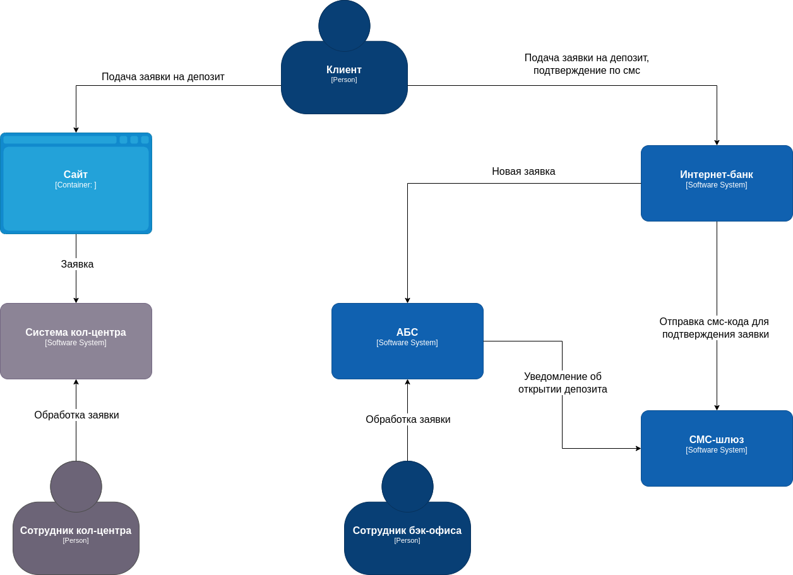
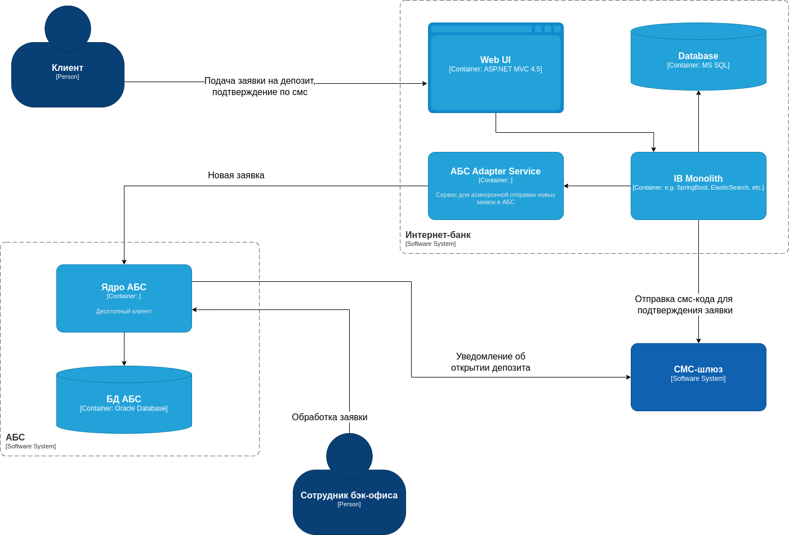

### **Название задачи:** 
схема концептуальной архитектуры открытия депозитов для MVP
### **Автор:** 
Uralz
### **Дата:**
05.04.2025
### **Функциональные требования**

|  №  | Действующие лица или системы       | Use Case                                                       | Описание                                                                                                                                                                                                 |
| :-: | :--------------------------------- | :------------------------------------------------------------- | :------------------------------------------------------------------------------------------------------------------------------------------------------------------------------------------------------- |
|  1  | Клиент, сайт                       | Просмотр депозитов на сайте                                    | 1. Клиент находится на сайте в разделе депозитов 2. Клиент видит список доступных депозитов с актуальными ставками                                                                                    |
|  2  | Клиент, сайт                       | Заявка на  депозит через сайт                                  | 1. Клиент оставляет на сайте свой номер телефона и Ф. И. О. 2. Клиенту звонит менеджер кол-центра для подтверждения заявки 3. Клиент идет в отделение банка для идетификации                       |
|  3  | Сотрудник кол-центра, клиент, АБС  | Подтверждение заявки на депозит, сделанной через сайт          | 1. Сотрудник кол-центра видит новую заявку 2. Сотрудник кол-центра изучает заявку на прдемет особых условий 3. Сотрудник кол-центра звонит клиенту, предлагает особые условия, подтверждает заявку |
|  4  | Клиент, интернет-банк              | Просмотр депозитов в интернет-банке                            | 1. Клиент находится в интернет-банке в разделе депозитов 2. Клиент видит список доступных депозитов с актуальными ставками и персонализированные ставки лично для него                                |
|  5  | Клиент, интернет-банк, смс-шлюз    | Заявка на  депозит через интернет-банк                         | 1. Клиент создает заявку, указывая в ней счет и сумму депозита 2. Клиент подтверждает завку по смс. 3. После подтверждения размера ставки и открытия депозита клиент получит смс-уведомление       |
|  6  | Сотрудник бэк-офиса, АБС, смс-шлюз | Подтверждение заявки на депозит, сделанной через интернет-банк | 1. Сотрудник видит новую заявку на депозит 2. Сотрудник подтверждает условия депозита в АБС банка 3. Клиенту отправляется смс-уведомление                                                          |

**Нефункциональные требования**

| **№** | **Требование**                                                                                                            |
| :---: | :------------------------------------------------------------------------------------------------------------------------ |
|   R   | Надёжность (Reliability)                                                                                                  |
|       | Сервисы должны работать 24/7 и быть доступны в 99,9% случаев                                                              |
|       | В случае сбоев в ЦОД необходимо, чтобы сервисы интернет-банка были доступны и выдерживали требуемую нагрузку              |
|       | Обеспечить резервное копирование данных                                                                                   |
|       |                                                                                                                           |
|   P   | Производительность (Performance)                                                                                          |
|       | Отклик по всем операциям в интерфейсе клиента должен быть максимально быстрым и занимать миллисекунды                     |
|       | Предусмотреть равномерное горизонтальное масштабирование                                                                  |
|       | Предусмотреть распределение запросов между серверами, приложениями и ЦОД                                                  |
|       | Обеспечить мониторинг и систему уведомлений об инцидентах                                                                 |
|       |                                                                                                                           |
|  +R   | + Ограничения (Restricitions)                                                                                             |
|       | При оформлении заявки на сайте, данные необходимо защищать с помощью механизма шифрования трафика                         |
|       | В интернет-банке данные при передаче также надо защитить механизмом шифрования                                            |
|       | При доработках во всех системах нужно как можно больше использовать технологии, которые уже есть в банке                  |
|       | При внедрении новых технологий необходимо, чтобы они были совместимы с существующими платформами разработки               |
|       | Для очередей сообщений лучше использовать Kafka                                                                           |
|       | Функционал работы с СМС требует доработки                                                                                 |
|       | Интернет-банк - это клиент-серверная система на веб-фреймворке ASP.NET MVC 4.5 на основе .NET Framework 4.5 и СУБД MS SQL |
|       | АБС - это десктопный клиент на Delphi и СУБД на Oracle                                                                    |
|       | Сайт - собственная разработка банка на PHP и React.js                                                                     |

### **Решение**

**Диаграмма контекста**

**Диаграмма контейнеров**

1. Добавить на сайт раздел депозитов. Реализовать интеграцию с API системы кол-центра
2. Добавить раздел депозитов в web-интерфейс интернет-банка
3. Добавить сервис-посредник между монолитом интернет-банка и АБС для удовлетворения требованию нежелательности их взаимодействия напрямую
4. Добавить в систему интернет-банка API для взаимодействия с смс-шлюзом и отправкой новых заявок в АБС через сервис-посредник
5. В АБС реализовать получение новых заявок из интернет-банка

Решение обусловленно тем, что для реализации MVP этих добработок достаточно для минимального удовлетворения требованиям. Упор делался на использование уже существующих технологий

### **Альтернативы**
В качестве альтернативы можно было внедрить асинхронное взаимодействие систем через Kafka. Это бы усложнило решение, так как текущая версия платформы интернет-банка несовместима с ней

**Недостатки, ограничения, риски**
Основной недостаток текущего решения видится в ограниченной возможности масштабировать компоненты системы для работы под нагрузкой. После реализации MVP и успешной проверки решения, следует сделать шаги для улучшения системы.
