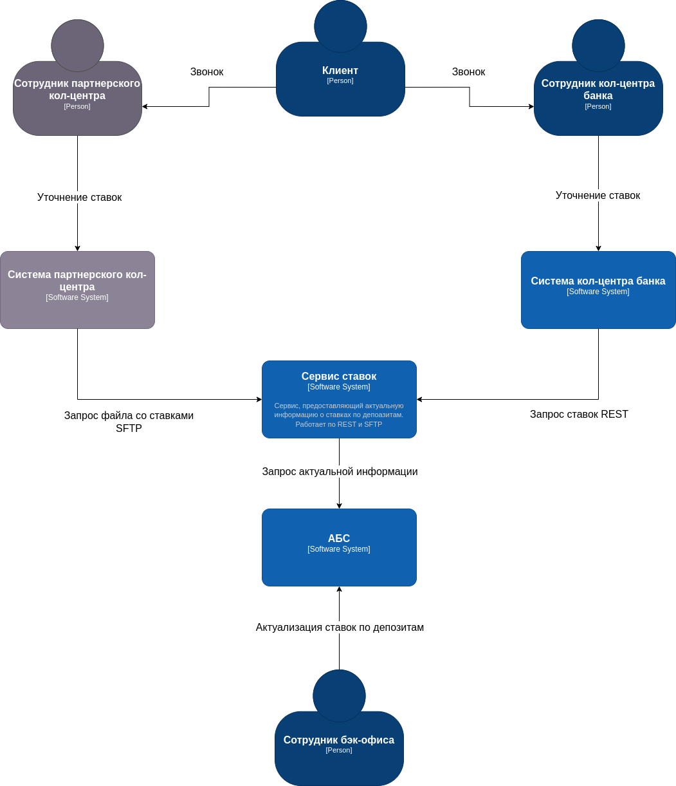
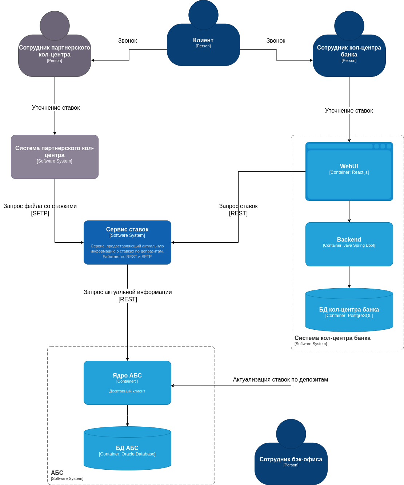

### **Название задачи:** 

Передача ставок в кол-центр

### **Автор:** 

Uralz

### **Дата:**

06.04.2025

### **Функциональные требования**

|  №  | Действующие лица или системы                                               | Use Case                                                      | Описание                                                                                                                                                                  |
| :-: | :------------------------------------------------------------------------- | :------------------------------------------------------------ | :------------------------------------------------------------------------------------------------------------------------------------------------------------------------ |
|  1  | Клиент, сотрудник кол-центра банка, система кол-центра банка               | Консультация по текущим ставкам в кол-центре банка            | 1. Клиент звонит сотруднику кол-центра банка 2. Сотрудник кол-центра банка смотрит текущие ставки в WebUI системы кол-центра банка, консультирует клиента              |
|  2  | Клиент, сотрудник партнерского кол-центра, система партнерского кол-центра | Консультация по текущим ставкам в партнерском кол-центре      | 1. Клиент звонит сотруднику партнерского кол-центра 2. Сотрудник партнерского кол-центра смотрит текущие ставки системе партнерского кол-центра, консультирует клиента |
|  3  | Система кол-центра банка, сервис ставок                                    | Актуализация текущих ставок в системе кол-центра банка        | WebUI системы кол-центра банка получает актуальные данные через REST API сервиса ставок                                                                                   |
|  4  | Система партнерского кол-центра, сервис ставок                             | Актуализация текущих ставок в системе партнерского кол-центра | Система партнерского кол-центра с заданной регулярностью получает файл со ставками от сервиса ставок                                                                      |
|  5  | Сервис ставок, АБС                                                         | Получение текущихз ставок из АБС                              | С заданной регулярностью происходит запрос актуальной информации от сервиса ставок к АБС через REST API (если такого эндпоинта нет, его нужно создать)                    |

**Нефункциональные требования**

| **№** | **Требование**                                                                                       |
| :---: | :--------------------------------------------------------------------------------------------------- |
|   R   | Надёжность (Reliability)                                                                             |
|       | Сервисы должны работать 24/7 и быть доступны в 99,9% случаев                                         |
|       | Избежать прямой работы систем кол-центров с API АБС                                                  |
|       |                                                                                                      |
|   P   | Производительность (Performance)                                                                     |
|       | Есть риск, что кол-центр будет перегружен                                                            |
|       |                                                                                                      |
|  +R   | + Ограничения (Restricitions)                                                                        |
|       | При актуализации данных по текущим ставкам необходимо защищать трафик с помощью механизма шифрования |
|       | Партнерский сервис может получать данные в виде файлов                                               |

### **Решение**

**Диаграмма контекста**

**Диаграмма контейнеров**

### **Альтернативы**

- Для передачи файла использовать e-mail
- Скачивать файл вручную
- Запрашивать информацию напрямую из АБС

**Недостатки, ограничения, риски**

Информация по ставкам для сотружников кол-центров будет приходить с опозданием, поэтому нужно правильно настроить периодичность обновлений во всех системах